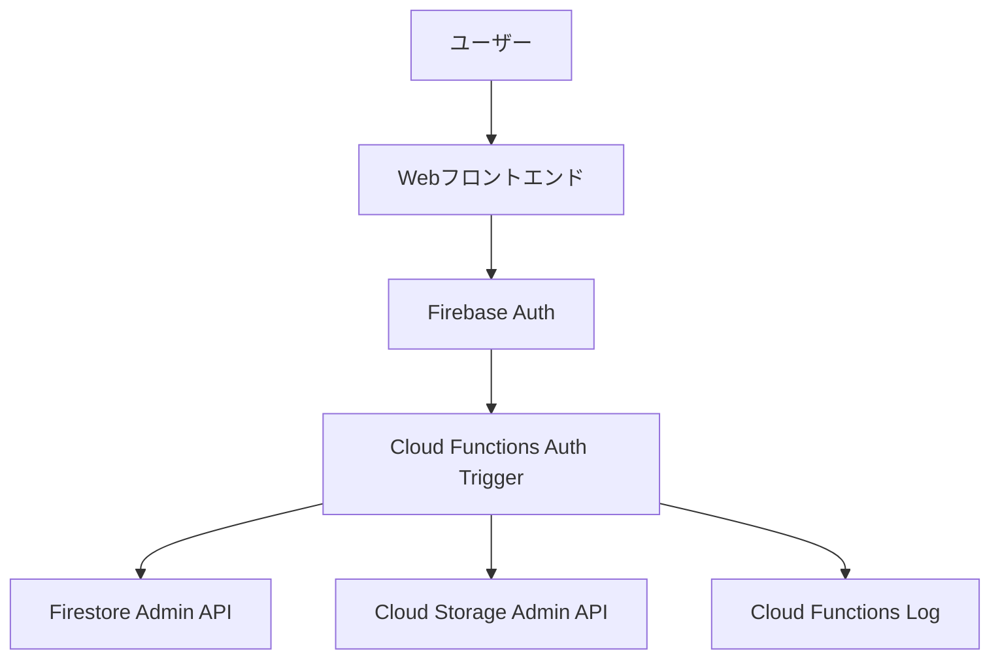

# アカウント削除機能 設計仕様書

## 1. 概要

### 1.1 目的
ユーザーがアカウントを完全に削除できる機能を提供し、プライバシー保護とGDPR等の法的要件に準拠する。

### 1.2 基本方針
- **完全性**: ユーザー関連のすべてのデータを確実に削除
- **セキュリティ**: サーバーサイドでの安全な削除処理
- **透明性**: 削除されるデータの範囲を明示
- **取り消し不可**: 削除実行後の復元は不可能

## 2. 要件定義

### 2.1 機能要件

#### 2.1.1 基本機能
- ユーザーアカウントの完全削除
- 関連データの一括削除
- 削除前の確認プロセス
- 削除完了通知

#### 2.1.2 削除対象データ
1. **Firebase Authentication**
   - ユーザーアカウント（UID）
   - 認証プロバイダー情報（Twitter）

2. **Firestore Collections**
   - `users/{userId}` - ユーザープロフィール
   - `users/{userId}/bookmarks/{bookmarkId}` - ブックマーク
   - `users/{userId}/purchase_plans/{planId}` - 購入予定
   - `users/{userId}/budget_summaries/{eventId}` - 予算サマリー
   - `edit_permission_requests/{requestId}` - 編集権限申請（userId一致）
   - `circle_permissions/{permissionId}` - サークル権限（userId一致）
   - `notifications/{notificationId}` - 通知（userId一致）
   - `eventHistory/{historyId}` - イベント履歴（userId一致）

3. **Cloud Storage**
   - プロフィール画像
   - アップロード画像

### 2.2 非機能要件

#### 2.2.1 パフォーマンス
- 削除処理完了時間: 30秒以内
- 削除対象データ量: 最大10,000件

#### 2.2.2 可用性
- Firebase Auth削除成功率: 99.9%
- Firestore削除成功率: 99.9%
- 削除失敗時の自動リトライ: 3回

#### 2.2.3 セキュリティ
- 認証ユーザーのみ削除可能
- 削除権限の厳格な検証
- 削除ログの記録

## 3. アーキテクチャ設計

### 3.1 システム構成



### 3.2 実装方式

#### 3.2.1 Cloud Functions Auth Trigger（推奨）
```typescript
export const deleteUserData = auth.user().onDelete(async (user) => {
  // Firebase Auth削除時に自動実行
  // 管理者権限でのデータ削除
})
```

**メリット:**
- Firebase Auth削除と同期した自動実行
- 管理者権限による確実なデータアクセス
- クライアント側エラーの影響を受けない
- トランザクションの保証

#### 3.2.2 フロントエンドフロー
1. 削除確認モーダル表示
2. ユーザー確認
3. `deleteUser()` 実行
4. Auth Triggerによる自動データ削除
5. 削除完了画面表示

### 3.3 データ削除戦略

#### 3.3.1 バッチ削除
```typescript
const batch = admin.firestore().batch()
// 最大500件まで一括削除
// 大量データは複数バッチに分割
```

#### 3.3.2 削除順序
1. **サブコレクション** → **親ドキュメント**
2. **参照データ** → **メインデータ**
3. **Firestore** → **Cloud Storage**
4. **Firebase Auth**（最後）

## 4. 詳細設計

### 4.1 Cloud Functions 実装

#### 4.1.1 メイン削除関数
```typescript
export const deleteUserData = auth.user().onDelete(async (user) => {
  const userId = user.uid
  console.log(`Starting account deletion for user: ${userId}`)
  
  try {
    // 1. Firestoreデータ削除
    await deleteFirestoreData(userId)
    
    // 2. Cloud Storageデータ削除
    await deleteStorageData(userId)
    
    // 3. 削除ログ記録
    await logDeletion(userId)
    
    console.log(`Account deletion completed for user: ${userId}`)
  } catch (error) {
    console.error(`Account deletion failed for user: ${userId}`, error)
    throw error
  }
})
```

#### 4.1.2 Firestore削除関数
```typescript
async function deleteFirestoreData(userId: string) {
  const db = admin.firestore()
  
  // ユーザーのサブコレクション削除
  await deleteCollection(db, `users/${userId}/bookmarks`)
  await deleteCollection(db, `users/${userId}/purchase_plans`)
  await deleteCollection(db, `users/${userId}/budget_summaries`)
  
  // 他のコレクションから該当データ削除
  await deleteByUserId(db, 'edit_permission_requests', userId)
  await deleteByUserId(db, 'circle_permissions', userId)
  await deleteByUserId(db, 'notifications', userId)
  await deleteByUserId(db, 'eventHistory', userId)
  
  // ユーザードキュメント削除
  await db.doc(`users/${userId}`).delete()
}
```

### 4.2 フロントエンド実装

#### 4.2.1 削除UI改修
```vue
<template>
  <div class="account-deletion">
    <h3>アカウント削除</h3>
    <div class="deletion-warning">
      <h4>削除されるデータ</h4>
      <ul>
        <li>ブックマーク（{{ userStats.totalBookmarks }}件）</li>
        <li>編集権限申請履歴</li>
        <li>サークル編集権限</li>
        <li>ユーザープロフィール情報</li>
      </ul>
      <p class="warning">⚠️ この操作は取り消せません</p>
    </div>
    <button @click="showDeleteConfirm = true">アカウント削除</button>
  </div>
</template>
```

#### 4.2.2 削除関数
```typescript
const deleteAccount = async () => {
  try {
    loading.value = true
    
    // Firebase Authアカウント削除のみ実行
    // Cloud Functionsが自動的にデータ削除を実行
    const { deleteUser } = getAuth()
    await deleteUser(user.value)
    
    // 削除完了画面へ遷移
    await navigateTo('/account/deleted')
    
  } catch (error) {
    handleDeletionError(error)
  } finally {
    loading.value = false
  }
}
```

## 5. エラーハンドリング

### 5.1 エラー分類

#### 5.1.1 クライアントサイドエラー
- `auth/requires-recent-login` - 再認証要求
- `auth/user-not-found` - ユーザー不在
- `auth/network-request-failed` - ネットワークエラー

#### 5.1.2 サーバーサイドエラー
- Firestore削除エラー
- Cloud Storage削除エラー
- 権限エラー

### 5.2 エラー対応

#### 5.2.1 再認証エラー
```typescript
if (error.code === 'auth/requires-recent-login') {
  // 再認証フローへ誘導
  await navigateTo('/auth/reauthenticate')
}
```

#### 5.2.2 部分削除失敗
```typescript
// Cloud Functionsでのリトライ機構
const MAX_RETRIES = 3
let retryCount = 0

while (retryCount < MAX_RETRIES) {
  try {
    await deleteCollection(db, collectionPath)
    break
  } catch (error) {
    retryCount++
    if (retryCount >= MAX_RETRIES) throw error
    await new Promise(resolve => setTimeout(resolve, 1000 * retryCount))
  }
}
```

## 6. セキュリティ考慮事項

### 6.1 認証・認可
- Firebase Authenticationによる本人確認
- Cloud Functions Admin SDKによる権限昇格
- ユーザーIDの厳格な検証

### 6.2 データ保護
- 削除データの完全消去
- ログからの機密情報除外
- 削除処理の監査ログ記録

### 6.3 GDPR準拠
- 「忘れられる権利」への対応
- 削除データの範囲明示
- 削除完了の証明

## 7. テスト仕様

### 7.1 単体テスト
- Cloud Functions削除関数
- エラーハンドリング
- データ完全性チェック

### 7.2 統合テスト
- エンドツーエンド削除フロー
- 削除データの確認
- エラーシナリオテスト

### 7.3 テストケース例
```typescript
describe('Account Deletion', () => {
  test('should delete all user data', async () => {
    // 1. テストユーザー作成
    // 2. データ作成（ブックマーク、権限等）
    // 3. アカウント削除実行
    // 4. データ削除確認
  })
  
  test('should handle deletion errors gracefully', async () => {
    // エラー時の挙動確認
  })
})
```

## 8. 監視・ログ

### 8.1 削除ログ
```typescript
const deletionLog = {
  userId,
  timestamp: admin.firestore.Timestamp.now(),
  deletedCollections: ['bookmarks', 'permissions', ...],
  status: 'completed',
  error: null
}
```

### 8.2 アラート
- 削除失敗時のSlack通知
- 大量削除時の管理者通知
- エラー率監視

## 9. 運用・メンテナンス

### 9.1 デプロイ手順
1. Cloud Functions デプロイ
2. 本番環境テスト
3. 監視設定確認

### 9.2 障害対応
- 削除失敗時の手動復旧手順
- データ不整合時の対処方法
- エスカレーション基準

## 10. 実装スケジュール

### Phase 1: 基盤実装（1週間）
- Cloud Functions Auth Trigger実装
- 基本的なFirestore削除機能

### Phase 2: UI実装（3日）
- フロントエンド削除フロー改修
- エラーハンドリング実装

### Phase 3: テスト・検証（1週間）
- 単体・統合テスト実装
- 本番環境での動作確認

### Phase 4: 運用開始（1日）
- 最終確認
- 機能リリース

## 11. 参考資料

- [Firebase Auth Admin SDK Documentation](https://firebase.google.com/docs/auth/admin)
- [Firestore Security Rules](https://firebase.google.com/docs/firestore/security/rules-conditions)
- [Cloud Functions Auth Triggers](https://firebase.google.com/docs/functions/auth-events)
- [GDPR Compliance Guide](https://gdpr.eu/)