# 02_geika check! システム仕様書

# 

**バージョン**: 1.1

**作成日**: 2025年5月31日

**作成者**: かいのいか

---

## 1. プロジェクト概要

### 1.1 アプリケーション概要

**アプリケーション名**: geika check!

**種別**: Webアプリケーション（PWA対応）

**概要**: アイカツ！シリーズオンリー同人イベント「芸能人はカードが命！（芸カ）」の**サークルチェックを効率化するためのWebアプリ**

### 1.2 開発背景・目的

- アイカツの楽曲「fashion check!」をモチーフとしたアプリケーション
- 同人イベントでのサークル情報収集・管理の効率化
- 参加者の利便性向上とイベント体験の最適化
- Twitter認証による確実なサークル所有者認証システム

### 1.3 対象ユーザー

- **一般参加者**: サークルチェック・ブックマーク利用
- **サークル参加者**: 自サークル情報の登録・管理
- **未ログインユーザー**: 基本的なサークル情報閲覧
- **システム管理者**: 編集権限申請の管理・承認

### 1.4 プロジェクトスコープ

**含まれるもの**:

- サークル情報の表示・検索・フィルタリング
- ブックマーク機能とマップ表示
- サークル情報の登録・編集
- 認証システム
- CSVエクスポート機能

**含まれないもの**:

- 決済機能
- 在庫管理システム

---

## 2. ユーザー要件定義

### 2.1 ペルソナ定義

**ペルソナ1: 一般参加者**

- イベント参加歴: 3年
- 主な関心: 星宮いちご、霧矢あおい関連
- デバイス: スマートフォン（iPhone）
- 利用シーン: 事前調査、当日のサークル巡回

**ペルソナ2: サークル参加者**

- 創作歴: 5年
- 主な創作: アイカツイラスト本、グッズ
- デバイス: PC、タブレット
- 利用シーン: サークル情報の事前登録、当日の情報更新

**ペルソナ3: システム管理者**

- 役割: 編集権限申請の審査・承認
- 利用シーン: 申請管理、異常検知、システム監視

### 2.2 ユーザーストーリー

**一般参加者として**:

- サークル情報を簡単に検索したい
- 気になるサークルをブックマークしたい
- 配置図上でブックマークを確認したい
- チェックリストをエクスポートしたい

**サークル参加者として**:

- **Twitterアカウントで認証してサークル編集権限を申請したい**
- **TwitterIDが一致する場合は即座に編集権限を取得したい**
- 自分のサークル情報を登録したい
- お品書きやSNSアカウントを宣伝したい
- 情報を随時更新したい

**システム管理者として**:

- **編集権限申請を効率的に管理したい**
- **Twitter ID不一致の申請を適切に審査したい**
- **自動承認・手動承認の状況を監視したい**

### 2.3 ユースケース図

```
[一般参加者]
├── サークル検索
├── サークル詳細確認
├── ブックマーク管理
├── マップ表示
└── CSVエクスポート

[サークル参加者]
├── 上記すべて
├── サークル情報登録
├── サークル情報編集
└── 公開設定管理

[システム管理者]
├── ユーザー管理
├── データ管理
└── システム監視

```

### 2.4 業務フロー

**事前準備フェーズ**:

1. サークル参加者がサークル情報を登録
2. 一般参加者が事前チェック・ブックマーク

**当日フェーズ**:

1. ブックマークリストで巡回計画
2. マップで位置確認
3. リアルタイムでチェック状況更新

---

## 3. 機能要件

### 3.1 機能一覧

| 機能ID | 機能名 | 優先度 | リリース | 変更点 |
| --- | --- | --- | --- | --- |
| F001 | サークル情報表示 | 必須 | MVP | - |
| F002 | サークル詳細表示 | 必須 | MVP | - |
| F003 | サークル検索・フィルタリング | 必須 | MVP | - |
| F004 | ブックマーク機能 | 必須 | MVP | - |
| F005 | マップ表示機能 | 必須 | MVP | - |
| F006 | Twitter認証機能 | 必須 | MVP | **変更** |
| F007 | **編集権限申請システム** | 必須 | MVP | **新規** |
| F008 | **半自動承認システム** | 必須 | MVP | **新規** |
| F009 | サークル情報登録・編集 | 必須 | MVP | **権限管理追加** |
| F010 | **管理者承認ダッシュボード** | 必須 | MVP | **新規** |
| F011 | CSVエクスポート | 中 | V1.1 | - |
| F012 | 購入予定マーク | 低 | V1.2 | - |
| F013 | 通知機能 | 低 | V2.0 | - |

### 3.2 優先度・リリース計画

**MVP（Minimum Viable Product）**:

- 基本的なサークル情報表示・検索
- ブックマーク機能
- マップ表示
- 認証・登録機能

**V1.1（機能拡張）**:

- CSVエクスポート
- 高度な検索オプション

**V1.2（利便性向上）**:

- 購入予定マーク
- UI/UX改善

### 3.3 機能詳細仕様

### 3.3.1 サークル情報表示機能

**機能概要**: サークル情報をカード形式で一覧表示

**入力**:

- ページネーション情報
- ソート条件

**処理**:

- Firestoreからサークル情報を取得
- 表示用データに変換
- カード形式でレンダリング

**出力**:

- サークル情報カード一覧
- ページネーション

**画面要素**:

```
┌─────────────────────────────────┐
│ [サークル名]          [ブックマーク] │
│ ジャンル: アイカツ！               │
│ 配置: 東1-あ-01a                 │
│ タグ: #いちご #あおい             │
│ [X] [pixiv] [お品書き]            │
└─────────────────────────────────┘

```

### 3.3.2 検索・フィルタリング機能

**機能概要**: 多様な条件でサークルを絞り込み

**検索条件**:

- テキスト検索（サークル名、タグ）
- ジャンル絞り込み
- 配置絞り込み（日程、エリア、ブロック）
- 成人向けフィルター
- SNSアカウント有無

**検索オプション**:

- AND/OR検索
- 部分一致/完全一致
- 除外検索

**ソート条件**:

- 配置順（デフォルト）
- サークル名（50音順）
- 更新日時順
- ブックマーク数順

### 3.3.3 ブックマーク機能

**機能概要**: サークルを分類してブックマーク

**ブックマークカテゴリ**:

- 📖 **チェック予定**: 見に行く予定
- ⭐ **気になる**: 興味がある
- 🔥 **優先**: 絶対に行く

**機能詳細**:

- ワンクリックでカテゴリ変更
- カテゴリごとの一覧表示
- メモ機能（任意）
- 並び替え（配置順、追加日順）

**データ構造**:

```tsx
interface Bookmark {
  id: string;
  userId: string;
  circleId: string;
  category: 'check' | 'interested' | 'priority';
  memo?: string;
  createdAt: Date;
  updatedAt: Date;
}

```

### 3.3.4 マップ表示機能

**機能概要**: 配置図上でブックマークを視覚的に表示

**基本仕様**:

- 配置図画像をベースマップとして使用
- SVGオーバーレイでブックマーク表示
- カテゴリ別色分け（チェック予定:青、気になる:黄、優先:赤）

**インタラクション**:

- ピンチ・ズーム対応
- ブックマークピンタップで詳細表示
- フィルター（カテゴリ別表示切り替え）

**技術実装**:

- Canvas/SVGベースの描画
- レスポンシブ対応
- パフォーマンス最適化

### 3.3.5 認証機能

**機能概要**: Twitter OAuth 2.0による認証システム

**認証フロー**:

1. ユーザーがTwitter認証ボタンをクリック
2. Twitter OAuth 2.0による認証
3. **TwitterIDを含むユーザー情報を取得**
4. Firebase Authenticationとの連携
5. ユーザー情報をFirestoreに保存

**取得情報**:

```tsx

tsx
interface TwitterUserInfo {
  uid: string;// Firebase UID
  email?: string;// メールアドレス
  displayName: string;// 表示名
  photoURL?: string;// プロフィール画像
  twitterId: string;// TwitterID (@を除く)
  twitterUsername: string;// Twitter表示名
  verifiedAt: Date;// 認証日時
}

```

### 3.3.6 編集権限申請システム

**機能概要**: サークル情報編集権限の申請・管理システム

**申請フロー**:

```mermaid

mermaid
graph TD
    A[ユーザーTwitter認証] --> B[サークル選択]
    B --> C[編集権限申請]
    C --> D{TwitterID一致チェック}
    D -->|完全一致| E[自動承認]
    D -->|不一致/未登録| F[手動承認待ち]
    E --> G[編集権限付与]
    F --> H[管理者審査]
    H --> I{承認判定}
    I -->|承認| G
    I -->|却下| J[申請却下]

```

**申請データ構造**:

```tsx

tsx
interface EditPermissionRequest {
  id: string;// 申請ID
  userId: string;// 申請者のFirebase UID
  circleId: string;// 対象サークルID
  applicantTwitterId: string;// 申請者のTwitterID
  registeredTwitterId?: string;// サークル登録済みTwitterID
  status: 'pending' | 'approved' | 'rejected' | 'auto_approved';
  isAutoApproved: boolean;// 自動承認フラグ
  evidenceUrls?: string[];// 証拠資料URL
  adminNote?: string;// 管理者メモ
  createdAt: Date;
  updatedAt: Date;
  approvedAt?: Date;
  approvedBy?: string;// 承認者ID
}

```

### 3.3.7 半自動承認システム

**機能概要**: TwitterID照合による自動承認機能

**自動承認条件**:

1. サークル情報にTwitterIDが登録済み
2. 申請者のTwitterIDと**完全一致**
3. Twitter認証が有効

**自動承認処理**:

```tsx

tsx
async function processAutoApproval(request: EditPermissionRequest): Promise<boolean> {
  const circle = await getCircle(request.circleId);

// TwitterID完全一致チェック
  if (circle.contact?.twitter === request.applicantTwitterId) {
// 自動承認実行
    await approveEditPermission(request.id, {
      status: 'auto_approved',
      isAutoApproved: true,
      approvedAt: new Date(),
      approvedBy: 'system'
    });

// 権限付与
    await grantEditPermission(request.userId, request.circleId);

    return true;
  }

  return false;
}

```

### 3.3.8 管理者承認ダッシュボード

**機能概要**: 編集権限申請の管理・承認画面

**画面構成**:

```

┌─────────────────────────────────────────┐
│ 編集権限申請 管理ダッシュボード           │
├─────────────────────────────────────────┤
│ [保留中: 3件] [承認済: 45件] [却下: 1件] │
│ [自動承認: 42件] [手動承認: 3件]         │
├─────────────────────────────────────────┤
│ 🟡 手動承認待ち                          │
│ ┌─────────────────────────────────────┐ │
│ │ サークル名: 星宮製作所              │ │
│ │ 申請者: @new_twitter_id            │ │
│ │ 登録ID: @old_twitter_id ❌不一致   │ │
│ │ 申請理由: 「アカウント変更しました」 │ │
│ │ 証拠資料: [画像1] [画像2]           │ │
│ │ [承認] [却下] [詳細確認]            │ │
│ └─────────────────────────────────────┘ │
├─────────────────────────────────────────┤
│ 🟢 自動承認完了                          │
│ ┌─────────────────────────────────────┐ │
│ │ サークル名: あおい工房              │ │
│ │ 申請者: @aoi_creator ✅完全一致     │ │
│ │ 承認日時: 2025-05-31 14:30         │ │
│ │ [詳細確認]                         │ │
│ └─────────────────────────────────────┘ │
└─────────────────────────────────────────┘

```

**管理機能**:

- 申請一覧・フィルタリング
- 一括承認・却下
- 申請詳細確認
- 証拠資料閲覧
- 承認履歴管理

### 3.3.9 サークル情報登録・編集機能

**機能概要**: サークル参加者による情報の登録・管理

**登録項目**:

```tsx
interface CircleRegistration {
  // 必須項目
  circleName: string;        // サークル名
  placement: PlacementInfo;  // 配置情報
  genre: string[];          // ジャンル

  // 任意項目
  circleKana?: string;      // カナ
  description?: string;     // 説明
  contact: {                // 連絡先
    twitter?: string;
    pixiv?: string;
    website?: string;
    oshinaUrl?: string;
  };
  tags: string[];          // タグ
  isAdult: boolean;        // 成人向け
}

```

**編集機能**:

- リアルタイムプレビュー
- 画像アップロード（お品書き等）
- 公開/非公開設定
- バリデーション

### 3.3.10 CSVエクスポート機能

**機能概要**: ブックマークリストをCSV形式でエクスポート

**出力形式**:

```
サークル名,ジャンル,配置,カテゴリ,メモ,X,お品書きURL
星宮製作所,アイカツ！,東1-あ-01a,優先,いちごグッズ欲しい,@example,https://...

```

**エクスポートオプション**:

- カテゴリ別出力
- 全ブックマーク出力
- カスタムフィールド選択

### 3.4 画面遷移図

```mermaid
graph TD
    A[トップページ] --> B[サークル一覧]
    B --> C[サークル詳細]
    B --> D[検索結果]
    A --> E[マップ表示]
    E --> C
    A --> F[ブックマーク一覧]
    F --> C
    A --> G[ログイン]
    G --> H[マイページ]
    H --> I[サークル登録]
    H --> J[サークル編集]
    F --> K[CSVエクスポート]

```



---

## 4. 非機能要件

### 4.1 パフォーマンス要件

- **初回読み込み**: 3秒以内
- **検索応答**: 500ms以内
- **画面遷移**: 200ms以内
- **同時接続数**: 1000ユーザー（イベント当日想定）

### 4.2 セキュリティ要件

- Firebase Authentication使用
- HTTPS通信必須
- XSS/CSRF対策実装
- 個人情報の適切な取り扱い

### 4.3 可用性要件

- **稼働率**: 99.9%以上
- **障害復旧**: 1時間以内
- **データバックアップ**: 日次自動実行

### 4.4 保守性要件

- TypeScript使用による型安全性
- ESLint/Prettier導入
- 単体テストカバレッジ80%以上
- コードレビュー必須

### 4.5 拡張性要件

- マイクロサービス指向設計
- API設計による外部連携対応
- 多イベント対応可能な設計

### 4.6 ユーザビリティ要件

- レスポンシブデザイン対応
- PWA対応（オフライン機能）
- アクセシビリティ（WCAG 2.1 AA準拠）

---

## 5. システム設計

### 5.1 システム構成図

```
[クライアント]
    ↓ HTTPS
[Vercel/Firebase Hosting]
    ↓
[Nuxt 3 Application]
    ↓
[Firebase Services]
├── Authentication
├── Firestore
├── Storage
└── Analytics

```

### 5.2 技術スタック

**フロントエンド**:

- Nuxt 3 (Vue 3 Composition API)
- TypeScript
- Tailwind CSS
- Headless UI

**バックエンド**:

- Firebase Firestore (NoSQL)
- Firebase Authentication
- Firebase Storage
- Firebase Functions (必要に応じて)

**開発・運用**:

- Vercel (デプロイ・ホスティング)
- GitHub Actions (CI/CD)
- ESLint + Prettier
- Vitest (テスト)

### 5.3 アーキテクチャ設計

**レイヤー構成**:

```
┌─────────────────┐
│ Presentation    │ ← Components, Pages
├─────────────────┤
│ Application     │ ← Composables, Stores
├─────────────────┤
│ Domain          │ ← Types, Interfaces
├─────────────────┤
│ Infrastructure  │ ← Firebase, API
└─────────────────┘

```

### 5.4 データベース設計

### 5.4.1 ER図


### 5.4.2 テーブル定義

**users コレクション**:

```tsx
interface User {
  uid: string;                    // Primary Key
  email: string;                  // メールアドレス
  displayName: string;            // 表示名
  photoURL?: string;             // プロフィール画像URL
  userType: 'general' | 'circle'; // ユーザー種別
  settings: {
    emailNotifications: boolean;
    adultContent: boolean;
  };
  createdAt: Timestamp;
  updatedAt: Timestamp;
}

```

**circles コレクション**:

```tsx
interface Circle {
  id: string;                    // Primary Key
  circleName: string;           // サークル名
  circleKana?: string;          // サークル名（カナ）
  genre: string[];              // ジャンル配列
  placement: {                  // 配置情報
    day: '1' | '2';            // 開催日
    area: string;              // エリア
    block: string;             // ブロック
    number: string;            // 番号
    position: 'a' | 'b';      // ab配置
  };
  description?: string;         // サークル説明
  contact: {                   // 連絡先情報
    twitter?: string;
    pixiv?: string;
    website?: string;
    oshinaUrl?: string;
  };
  tags: string[];              // タグ配列
  isAdult: boolean;            // 成人向けフラグ
  ownerId?: string;            // 所有者ID
  isPublic: boolean;           // 公開フラグ
  eventId: string;             // イベントID
  createdAt: Timestamp;
  updatedAt: Timestamp;
}

```

**bookmarks コレクション**:

```tsx
interface Bookmark {
  id: string;                           // Primary Key
  userId: string;                       // ユーザーID
  circleId: string;                     // サークルID
  category: 'check' | 'interested' | 'priority'; // カテゴリ
  memo?: string;                        // メモ
  createdAt: Timestamp;
  updatedAt: Timestamp;
}

```

**edit_permission_requests コレクション**:

```tsx

tsx
interface EditPermissionRequest {
  id: string;
  userId: string;
  circleId: string;
  applicantTwitterId: string;
  registeredTwitterId?: string;
  status: 'pending' | 'approved' | 'rejected' | 'auto_approved';
  isAutoApproved: boolean;
  evidenceUrls?: string[];
  adminNote?: string;
  rejectionReason?: string;
  createdAt: Timestamp;
  updatedAt: Timestamp;
  approvedAt?: Timestamp;
  approvedBy?: string;
}

```

**circle_permissions コレクション**:

```tsx

tsx
interface CirclePermission {
  id: string;
  userId: string;
  circleId: string;
  permission: 'owner' | 'editor';
  grantedAt: Timestamp;
  grantedBy: string;// 'system' | adminUserId
  isActive: boolean;
}

```

### 5.4.3 インデックス設計

**パフォーマンス向上のためのインデックス**:

```jsx
// circles コレクション
circles.createIndex({ "genre": 1, "placement.day": 1 })
circles.createIndex({ "placement.area": 1, "placement.block": 1 })
circles.createIndex({ "tags": 1 })
circles.createIndex({ "isPublic": 1, "eventId": 1 })
circles.createIndex({ "ownerId": 1 })

// bookmarks コレクション
bookmarks.createIndex({ "userId": 1, "category": 1 })
bookmarks.createIndex({ "userId": 1, "createdAt": -1 })
bookmarks.createIndex({ "circleId": 1 })

```

---

### 5.5 認証・認可設計（改良版）

**権限管理システム**:

```tsx

tsx
interface UserRole {
  userId: string;
  globalRole: 'admin' | 'general';
  circlePermissions: CirclePermission[];
}

interface CirclePermission {
  circleId: string;
  permission: 'owner' | 'editor';
  grantedAt: Date;
  grantedBy: string;// 'system' | adminUserId
}

// 権限チェック関数
function canEditCircle(userId: string, circleId: string): boolean {
  const userRole = getUserRole(userId);
  return userRole.circlePermissions.some(
    p => p.circleId === circleId && ['owner', 'editor'].includes(p.permission)
  );
}

```

## 6. UI/UX設計

### 6.1 デザインコンセプト

**テーマ**: 「アイカツらしい華やかさと使いやすさの両立」

**キーワード**:

- ✨ キラキラ感
- 🎵 リズミカル
- 🌈 カラフル
- 📱 モバイルフレンドリー

### 6.2 カラーパレット・タイポグラフィ

**メインカラー**:

```css
:root {
  --primary: #FF69B4;        /* アイカツピンク */
  --primary-dark: #E91E63;   /* 濃いピンク */
  --secondary: #87CEEB;      /* スカイブルー */
  --accent: #FFD700;         /* ゴールド */
  --success: #4CAF50;        /* グリーン */
  --warning: #FF9800;        /* オレンジ */
  --error: #F44336;          /* レッド */
}

```

**グレースケール**:

```css
:root {
  --gray-50: #FAFAFA;
  --gray-100: #F5F5F5;
  --gray-200: #EEEEEE;
  --gray-300: #E0E0E0;
  --gray-400: #BDBDBD;
  --gray-500: #9E9E9E;
  --gray-600: #757575;
  --gray-700: #616161;
  --gray-800: #424242;
  --gray-900: #212121;
}

```

**タイポグラフィ**:

```css
/* 日本語フォント */
font-family: 'Noto Sans JP', 'Hiragino Kaku Gothic ProN', 'ヒラギノ角ゴ ProN W3', Meiryo, メイリオ, Osaka, 'MS PGothic', arial, helvetica, sans-serif;

/* 見出し */
.text-3xl { font-size: 1.875rem; font-weight: 700; }
.text-2xl { font-size: 1.5rem; font-weight: 600; }
.text-xl { font-size: 1.25rem; font-weight: 600; }

/* 本文 */
.text-base { font-size: 1rem; font-weight: 400; }
.text-sm { font-size: 0.875rem; font-weight: 400; }

```

### 6.3 レスポンシブデザイン方針

**ブレークポイント**:

```css
/* Mobile First */
.container {
  /* xs: ~640px */
  max-width: 100%;

  /* sm: 640px~ */
  @media (min-width: 640px) {
    max-width: 640px;
  }

  /* md: 768px~ */
  @media (min-width: 768px) {
    max-width: 768px;
  }

  /* lg: 1024px~ */
  @media (min-width: 1024px) {
    max-width: 1024px;
  }

  /* xl: 1280px~ */
  @media (min-width: 1280px) {
    max-width: 1280px;
  }
}

```

**レスポンシブ戦略**:

- **Mobile First**: スマートフォンを基準とした設計
- **Progressive Enhancement**: 大画面で機能を段階的に追加
- **Flexible Grid**: CSS Grid + Flexboxによる柔軟なレイアウト

### 6.4 ワイヤーフレーム

**トップページ（モバイル）**:

```
┌─────────────────────────┐
│ [☰] geika check! [👤]   │
├─────────────────────────┤
│ [🔍 サークル検索...]      │
├─────────────────────────┤
│ [フィルター] [ソート]     │
├─────────────────────────┤
│ ┌─────────────────────┐ │
│ │ サークル名A         │ │
│ │ アイカツ！          │ │
│ │ 東1-あ-01a    [⭐]  │ │
│ │ #いちご #あおい     │ │
│ │ [X] [pixiv] [お品書] │ │
│ └─────────────────────┘ │
│ ┌─────────────────────┐ │
│ │ サークル名B         │ │
│ │ ...                 │ │
│ └─────────────────────┘ │
├─────────────────────────┤
│ [マップ] [ブックマーク]   │
└─────────────────────────┘

```

**マップページ（タブレット）**:

```
┌───────────────────────────────────────┐
│ geika check! - マップ表示              │
├───────────────────────────────────────┤
│ [📖チェック予定] [⭐気になる] [🔥優先]  │
├───────────────────────────────────────┤
│                                       │
│     ┌─────────配置図─────────┐        │
│     │  🔥  📖     ⭐    📖  │        │
│     │      📖  🔥     ⭐     │        │
│     │  ⭐     📖   🔥  📖   │        │
│     │     🔥    📖     ⭐    │        │
│     └─────────────────────────┘        │
│                                       │
├───────────────────────────────────────┤
│ [ズーム-] [ズーム+] [リセット]         │
└───────────────────────────────────────┘

```

### 6.5 画面設計書

**コンポーネント一覧**:

1. **CircleCard**
    - サークル情報の表示
    - ブックマークボタン
    - 外部リンクボタン
2. **SearchBar**
    - テキスト検索入力
    - フィルターボタン
    - ソートオプション
3. **FilterPanel**
    - ジャンル選択
    - 配置絞り込み
    - 成人向けフィルター
4. **BookmarkButton**
    - カテゴリ選択
    - 状態表示
    - アニメーション
5. **MapView**
    - 配置図表示
    - ブックマークピン
    - ズーム機能
6. **NavigationBar**
    - メインナビゲーション
    - ログイン状態表示
    - レスポンシブメニュー

---

## 7. API設計

### 7.1 API仕様概要

**アーキテクチャ**: RESTful API

**認証方式**: Firebase Authentication (Bearer Token)

**データ形式**: JSON

**文字コード**: UTF-8

### 7.2 エンドポイント一覧

### サークル関連API

```
GET    /api/circles              # サークル一覧取得
GET    /api/circles/:id          # サークル詳細取得
POST   /api/circles              # サークル新規作成 (要認証)
PUT    /api/circles/:id          # サークル更新 (要認証)
DELETE /api/circles/:id          # サークル削除 (要認証)
GET    /api/circles/search       # サークル検索

```

### ブックマーク関連API

```
GET    /api/bookmarks            # ブックマーク一覧取得 (要認証)
POST   /api/bookmarks            # ブックマーク作成 (要認証)
PUT    /api/bookmarks/:id        # ブックマーク更新 (要認証)
DELETE /api/bookmarks/:id        # ブックマーク削除 (要認証)
GET    /api/bookmarks/export     # CSVエクスポート (要認証)

```

### ユーザー関連API

```
GET    /api/users/me             # 自分のユーザー情報取得 (要認証)
PUT    /api/users/me             # ユーザー情報更新 (要認証)

```

### イベント関連API

```
GET    /api/events               # イベント一覧取得
GET    /api/events/:id           # イベント詳細取得

```

### 編集権限関連API

```

POST   /api/edit-permissions/request     # 編集権限申請
GET    /api/edit-permissions             # 申請一覧取得 (管理者のみ)
PUT    /api/edit-permissions/:id/approve # 申請承認 (管理者のみ)
PUT    /api/edit-permissions/:id/reject  # 申請却下 (管理者のみ)
GET    /api/edit-permissions/my-requests # 自分の申請履歴
POST   /api/edit-permissions/auto-check  # 自動承認チェック

```

### Twitter認証関連API

```

POST   /api/auth/twitter                 # Twitter認証
GET    /api/auth/twitter/verify          # Twitter情報検証
PUT    /api/auth/twitter/update          # Twitter情報更新

```

### 7.3 レスポンス形式

**成功レスポンス**:

```json
{
  "success": true,
  "data": {
    // レスポンスデータ
  },
  "meta": {
    "total": 100,
    "page": 1,
    "limit": 20
  }
}

```

**エラーレスポンス**:

```json
{
  "success": false,
  "error": {
    "code": "CIRCLE_NOT_FOUND",
    "message": "指定されたサークルが見つかりません",
    "details": {}
  }
}

```

### 7.4 エラーハンドリング

**HTTPステータスコード**:

- 200: 成功
- 201: 作成成功
- 400: リクエストエラー
- 401: 認証エラー
- 403: 権限エラー
- 404: リソース不明
- 500: サーバーエラー

**エラーコード定義**:

```tsx
enum ErrorCodes {
  // 認証関連
  UNAUTHORIZED = 'UNAUTHORIZED',
  FORBIDDEN = 'FORBIDDEN',

  // バリデーション関連
  VALIDATION_ERROR = 'VALIDATION_ERROR',
  INVALID_INPUT = 'INVALID_INPUT',

  // リソース関連
  CIRCLE_NOT_FOUND = 'CIRCLE_NOT_FOUND',
  BOOKMARK_NOT_FOUND = 'BOOKMARK_NOT_FOUND',

  // システム関連
  INTERNAL_ERROR = 'INTERNAL_ERROR',
  SERVICE_UNAVAILABLE = 'SERVICE_UNAVAILABLE'
}

```

---

## 8. セキュリティ設計

### 8.1 認証・認可方式

**認証フロー**:

1. Firebase Authentication (Google OAuth)
2. JWTトークンによる状態管理
3. リフレッシュトークンによる自動更新

**認可設計**:

```tsx
interface UserPermissions {
  canViewCircles: boolean;        // サークル閲覧
  canBookmarkCircles: boolean;    // ブックマーク
  canCreateCircles: boolean;      // サークル作成
  canEditOwnCircles: boolean;     // 自サークル編集
  canDeleteOwnCircles: boolean;   // 自サークル削除
  canViewAdultContent: boolean;   // 成人向け表示
}

// 権限マトリックス
const ROLE_PERMISSIONS = {
  guest: {
    canViewCircles: true,
    canBookmarkCircles: false,
    canCreateCircles: false,
    canEditOwnCircles: false,
    canDeleteOwnCircles: false,
    canViewAdultContent: false,
  },
  general: {
    canViewCircles: true,
    canBookmarkCircles: true,
    canCreateCircles: false,
    canEditOwnCircles: false,
    canDeleteOwnCircles: false,
    canViewAdultContent: true, // 設定による
  },
  circle: {
    canViewCircles: true,
    canBookmarkCircles: true,
    canCreateCircles: true,
    canEditOwnCircles: true,
    canDeleteOwnCircles: true,
    canViewAdultContent: true, // 設定による
  }
};

```

### 8.2 データ保護

**Firestore Security Rules**:

```jsx
rules_version = '2';
service cloud.firestore {
  match /databases/{database}/documents {
    // ユーザー情報
    match /users/{userId} {
      allow read, write: if request.auth != null && request.auth.uid == userId;
    }

    // サークル情報
    match /circles/{circleId} {
      allow read: if resource.data.isPublic == true;
      allow create: if request.auth != null &&
                       request.auth.uid == request.resource.data.ownerId;
      allow update, delete: if request.auth != null &&
                              request.auth.uid == resource.data.ownerId;
    }

    // ブックマーク
    match /bookmarks/{bookmarkId} {
      allow read, write: if request.auth != null &&
                           request.auth.uid == resource.data.userId;
    }
  }
}

```

### 8.3 セキュリティ対策

**XSS (Cross-Site Scripting) 対策**:

- 入力値のサニタイゼーション
- CSP (Content Security Policy) 設定
- HTMLエスケープ処理

**CSRF (Cross-Site Request Forgery) 対策**:

- SameSite Cookie設定
- CSRFトークン実装
- Origin検証

**その他のセキュリティ対策**:

- HTTPS強制
- セキュリティヘッダー設定
- レート制限実装
- 入力値バリデーション

### 8.4 プライバシー保護

**個人情報の取り扱い**:

- 最小限の情報収集
- データの暗号化保存
- アクセスログの管理
- データ削除機能の提供

**GDPR対応**:

- データポータビリティ
- 忘れられる権利
- 処理の透明性
- データ保護影響評価

---

## 9. 開発・運用計画

### 9.1 開発体制

**チーム構成(個人開発)**:

- かいのいか: 1名

**開発期間**: 3ヶ月

- 設計フェーズ: 2週間
- 開発フェーズ: 8週間
- テスト・デプロイフェーズ: 2週間

### 9.2 開発プロセス

**ブランチ戦略**: Git Flow

```
main (本番環境)
├── develop (開発環境)
│   ├── feature/xxx (機能開発)
│   └── release/x.x.x (リリース準備)
└── hotfix/xxx (緊急修正)

```

### 9.3 テスト計画

**テスト種別**:

1. **単体テスト (Unit Test)**
    - カバレッジ: 80%以上
    - フレームワーク: Vitest
    - 対象: Utils, Composables, Services
2. **コンポーネントテスト**
    - フレームワーク: Vue Test Utils
    - 対象: Vue Component
3. **統合テスト (Integration Test)**
    - API通信テスト
    - Firebase接続テスト
    - 認証フローテスト
4. **E2Eテスト (End-to-End Test)**
    - フレームワーク: Playwright
    - シナリオ: 主要ユーザーフロー
    - 頻度: リリース前
5. **パフォーマンステスト**
    - Lighthouse CI
    - Core Web Vitals計測
    - 負荷テスト (K6)

### 9.4 デプロイ戦略

**環境構成**:

```
開発環境 (Development)
├── ブランチ: develop
├── URL: <https://dev-geika-check.vercel.app>
└── Firebase Project: geika-check-dev

ステージング環境 (Staging)
├── ブランチ: release/*
├── URL: <https://staging-geika-check.vercel.app>
└── Firebase Project: geika-check-staging

本番環境 (Production)
├── ブランチ: main
├── URL: <https://geika-check.com>
└── Firebase Project: geika-check-prod

```

**CI/CDパイプライン**:

```yaml
# .github/workflows/deploy.yml
name: Deploy
on:
  push:
    branches: [main, develop]

jobs:
  test:
    runs-on: ubuntu-latest
    steps:
      - uses: actions/checkout@v3
      - uses: actions/setup-node@v3
      - run: npm ci
      - run: npm run lint
      - run: npm run test
      - run: npm run build

  deploy:
    needs: test
    runs-on: ubuntu-latest
    if: github.ref == 'refs/heads/main'
    steps:
      - uses: actions/checkout@v3
      - run: npm ci
      - run: npm run build
      - uses: amondnet/vercel-action@v20

```

### 9.5 運用・保守計画

**監視項目**:

- アプリケーションパフォーマンス
- エラー率・レスポンス時間
- ユーザー行動分析
- システムリソース使用量

**保守作業**:

- 定期セキュリティアップデート
- パフォーマンスチューニング
- バグ修正・機能改善
- データベース最適化

### 9.6 監視・ログ設計

**監視ツール**:

- **Firebase Analytics**: ユーザー行動分析
- **Sentry**: エラートラッキング
- **Vercel Analytics**: パフォーマンス監視
- **Google Search Console**: SEO監視

**ログ設計**:

```tsx
interface ApplicationLog {
  timestamp: Date;
  level: 'error' | 'warn' | 'info' | 'debug';
  category: 'auth' | 'api' | 'ui' | 'performance';
  message: string;
  userId?: string;
  metadata: Record<string, any>;
}

// ログレベル別の保存期間
const LOG_RETENTION = {
  error: '90日',
  warn: '30日',
  info: '14日',
  debug: '7日'
};

```

---

## 10. リスク管理

### 10.1 技術リスク

**リスク1: Firebase制限による性能問題**

- 影響度: 高
- 確率: 中
- 対策:
    - 事前の負荷テスト実施
    - キャッシュ戦略の実装
    - Firebase Blaze プランへのアップグレード準備

**リスク2: サードパーティサービス障害**

- 影響度: 高
- 確率: 低
- 対策:
    - 障害時のフォールバック機能
    - 複数サービスの冗長化検討
    - SLA確認とエスカレーション体制

### 10.2 スケジュールリスク

**リスク3: 機能要件の追加・変更**

- 影響度: 中
- 確率: 高
- 対策:
    - スコープ管理の徹底
    - 変更管理プロセスの確立
    - バッファ期間の確保

**リスク4: 開発リソース不足**

- 影響度: 高
- 確率: 中
- 対策:
    - 優先度に応じた機能削減
    - 外部リソースの活用検討
    - 段階的リリース計画

### 10.3 リソースリスク

**リスク5: 運用コスト超過**

- 影響度: 中
- 確率: 中
- 対策:
    - コスト監視アラートの設定
    - 使用量制限の実装
    - 最適化施策の継続実行

### 10.4 外部依存リスク

**リスク6: イベント情報の入手困難**

- 影響度: 高
- 確率: 低
- 対策:
    - 複数の情報源確保
    - 手動入力機能の提供
    - コミュニティとの連携強化

---

## 11. 今後の拡張計画

---

## 12. 付録

### 12.1 参考資料

**技術文書**:

- [Nuxt 3 Documentation](https://nuxt.com/)
- [Firebase Documentation](https://firebase.google.com/docs)
- [Tailwind CSS Documentation](https://tailwindcss.com/)
- [Vue 3 Composition API](https://vuejs.org/guide/composition-api-introduction.html)

**デザイン参考**:

- [Material Design Guidelines](https://material.io/design)
- [Apple Human Interface Guidelines](https://developer.apple.com/design/human-interface-guidelines/)
- [アクセシビリティガイドライン (WCAG 2.1)](https://waic.jp/translations/WCAG21/)

### 12.3 変更履歴

| バージョン | 日付 | 変更者 | 変更内容 |
| --- | --- | --- | --- |
| 1.0 | 2025-05-31 | かいのいか | 初版作成 |
| 1.1 | 2025-05-31 | かいのいか | Twitter認証による半自動承認システム追加 |

---